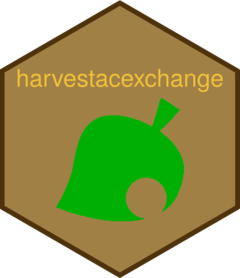

<!-- README.md is generated from README.Rmd. Please edit that file -->

# harvestacexchange 

<!-- badges: start -->

<!-- badges: end -->

**harvestacexchange** provides function to harvest
[animalcrossingexchange.com](https://app.animalcrossingexchange.com).

## Installation

You can install from GitHub with:

``` r
# install.packages("remotes")
remotes::install_github("abichat/harvestacexchange")
```

You need to have [Node.js](https://nodejs.org/) installed on your
computer.

## Harvesting

``` r
library(harvestacexchange)
```

When you install **harvestacexchange**, you need to install the JS
dependencies once.

``` r
install_js_dep()
```

### Harvest

You can harvest turnips prices from
<https://app.animalcrossingexchange.com/turnips/traders>

``` r
df_turnips <- turnips()
df_turnips
#> # A tibble: 21 x 7
#>    price waiters time        grade voters line      tags         
#>    <dbl>   <dbl> <chr>       <dbl>  <dbl> <chr>     <chr>        
#>  1   654       5 24m           100      5 Line Full Tips Required
#>  2   609      19 2.0h          100     48 Line Full No tag       
#>  3   588      17 1.3h          100     46 Join Line Tips Required
#>  4   587      12 45m           100      8 Join Line Tips Required
#>  5   582      22 2.2h          100      1 Join Line No tag       
#>  6   555       0 0m             98    160 Line Full Tips Required
#>  7   538       6 Not Started    NA      0 Join Line Tips Required
#>  8   531      12 41m           100     10 Join Line No tag       
#>  9   529       0 0m            100      8 Line Full Tips Required
#> 10   507       3 21m           100      3 Join Line No tag       
#> # … with 11 more rows
```

and list of events from
<https://app.animalcrossingexchange.com/events/guests>

``` r
df_events <- events()
df_events
#> # A tibble: 43 x 8
#>    event      waiters time     grade voters line   notice                  tags 
#>    <chr>        <dbl> <chr>    <dbl>  <dbl> <chr>  <chr>                   <chr>
#>  1 Other            0 Not Sta…   100      6 Join … "Looking for 4 fossils… No t…
#>  2 Other            0 Not Sta…   100      9 Join … "Looking for friendly … No t…
#>  3 Villager …       0 Not Sta…    NA      0 Join … "Vesta's crafting a pe… No t…
#>  4 Celeste          0 Not Sta…   100     39 Join … "Heyyy! Will be doing … No t…
#>  5 Villager …       0 Not Sta…    NA      0 Join … "Chevre is crafting a … No t…
#>  6 Villager …       0 0m         100     14 Join … "ROSE CROWN CRAFTED BY… No t…
#>  7 Other            0 0m          98     63 Join … "Want to make an easy … No t…
#>  8 Other            0 0m          97    496 Join … "Buying fish bait. 20 … No t…
#>  9 Shopping         2 Not Sta…    NA      0 Join … "Hi! Doing Fossils Tra… No t…
#> 10 Villager …       4 10m         97     38 Join … "Astrid is crafting a … No t…
#> # … with 33 more rows
```

### Filter

**harvestacexchange** provides some useful filtering functions

``` r
df_turnips %>% 
  filter_price_min(price_min = 500) %>% 
  filter_no_tag()
#> # A tibble: 6 x 7
#>   price waiters time  grade voters line      tags  
#>   <dbl>   <dbl> <chr> <dbl>  <dbl> <chr>     <chr> 
#> 1   609      19 2.0h    100     48 Line Full No tag
#> 2   582      22 2.2h    100      1 Join Line No tag
#> 3   531      12 41m     100     10 Join Line No tag
#> 4   507       3 21m     100      3 Join Line No tag
#> 5   507       6 21m      NA      0 Join Line No tag
#> 6   505       4 17m     100      2 Join Line No tag

df_events %>% 
  filter_words("gold") %>% 
  filter_grade_min(grade_min = 90)
#> # A tibble: 8 x 8
#>   event     waiters time    grade voters line    notice                    tags 
#>   <chr>       <dbl> <chr>   <dbl>  <dbl> <chr>   <chr>                     <chr>
#> 1 Other           0 0m         97    496 Join L… "Buying fish bait. 20 fi… No t…
#> 2 Villager…       4 10m        97     38 Join L… "Astrid is crafting a lu… No t…
#> 3 Shopping        0 Not St…    NA      0 Join L… "Hi! Iâ\u0080\u0099m buy… No t…
#> 4 Villager…       1 19m        NA      0 Join L… "NO FEE CRAFTING: ironwo… No t…
#> 5 Villager…       2 11m        NA      0 Join L… "Colton is crafting Gold… No t…
#> 6 Villager…       2 16m       100      3 Join L… "My Dear Olivia is now c… No t…
#> 7 Villager…       0 0m        100     80 Line F… "Diana is crafting GOLDE… No t…
#> 8 Villager…       4 26m       100     11 Join L… "Raymond is crafting GOL… No t…
```

You can also compare these data to old versions and keep only the new
lines with `filter_old_turnips()` and `filter_old_events()`.

### Telegram

If you have configured a [Telegram
bot](https://github.com/ebeneditos/telegram.bot), you can send messages
with `message_turnips()` and `message_events()`.
